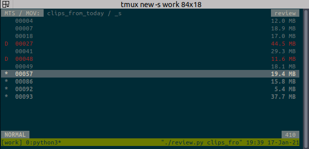

# HMC Tools
Command line tools that may be handy to convert and sort recorded clips from a Panasonic HMC150.

## convert.py
Convert all .MTS files from a directory that contains `.MTS` files to more suitable formats for reviewing and editing the clips.

Dependencies:
* Python 3
* `ffmpeg` (called as subprocess)

## review.py
Quickly review the recorded clips and sort out bad ones.
Navigate using the keyboard only in a vim-like way.
Always see which clips you have already checked and which are marked for deletion.
Quickly play back a selected clip and mark them for deletion if it was not good.
Finally remove the `.MTS` and the corresponding converted `.MOV` files of the marked clips from disk to free up space and be able to edit faster.

Dependencies:
* Python 3
* VLC player (`cvlc` called as subprocess)

